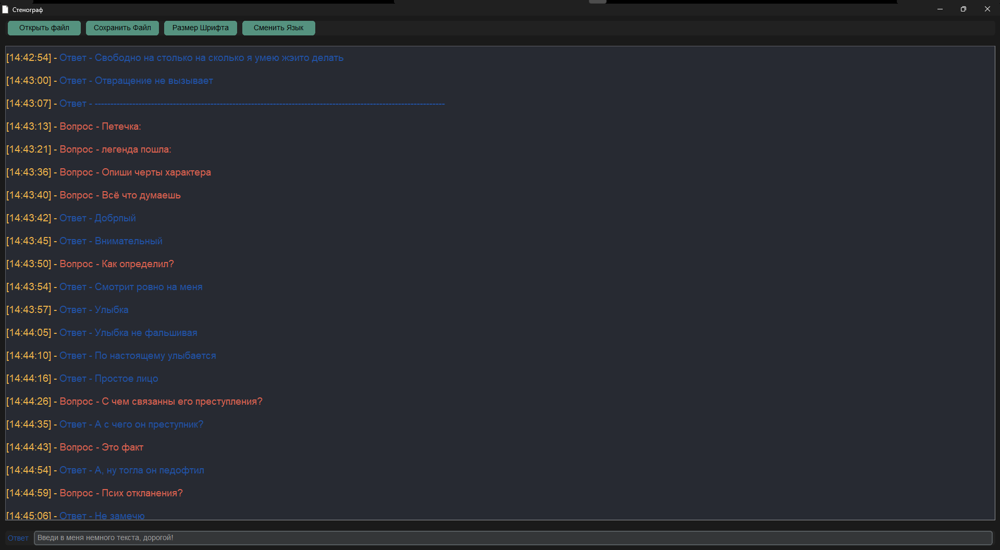

# Приложение для Стенографии
---


---
## Данное приложение предоставляет базовый функционал для конечного пользователя:

- **Мультиязычность**: Поддержка следующих языков интерфейса:
  - Русский
  - Английский
  - Французский
- **Формат файла**: Файл стенографии сохраняется в формате `.txt`.
- **Автоматическое добавление меток**:
  - Время, установленное на системе, в формате `[Час:Минута:Секунда]`.
  - Метки "Вопрос" и "Ответ".
  - Каждая метка выделяется отдельным цветом для лучшего восприятия.
- **Открытие и сохранение файлов**: Возможность открывать и сохранять файлы стенографии.
- **Изменение размера шрифта**: Возможность изменять размер шрифта в интерфейсе.
- **Обновление поля вывода**: Поле вывода стенографии обновляется при каждом нажатии на `Enter`.

## Управление

- **Смена метки "Вопрос"/"Ответ"**: Используются клавиши `Up` и `Down`.
- **Отправка текста в файл**: Нажатие на `Enter`.
- **Сохранение файла**: Файл сохраняется автоматически при каждом нажатии на `Enter`.

## Установка и запуск

### Поддержка Linux и macOS

На данный момент поддержка Linux и macOS реализована через запуск `main.py`. Не забудьте установить зависимости из `requirements.txt`, если вы используете виртуальное окружение.

#### Установка зависимостей Python

В директории, куда вы клонировали репозиторий, выполните следующую команду:

```bash
pip install -r requirements.txt
```

### Поддержка Windows

Для Windows доступен портативный `.exe` файл. Актуальная версия находится во вкладке "Releases".

## Лицензия MIT

## Автор

@CatOfBong

## Контакты

- Не надо вам моих контактов

---

---

